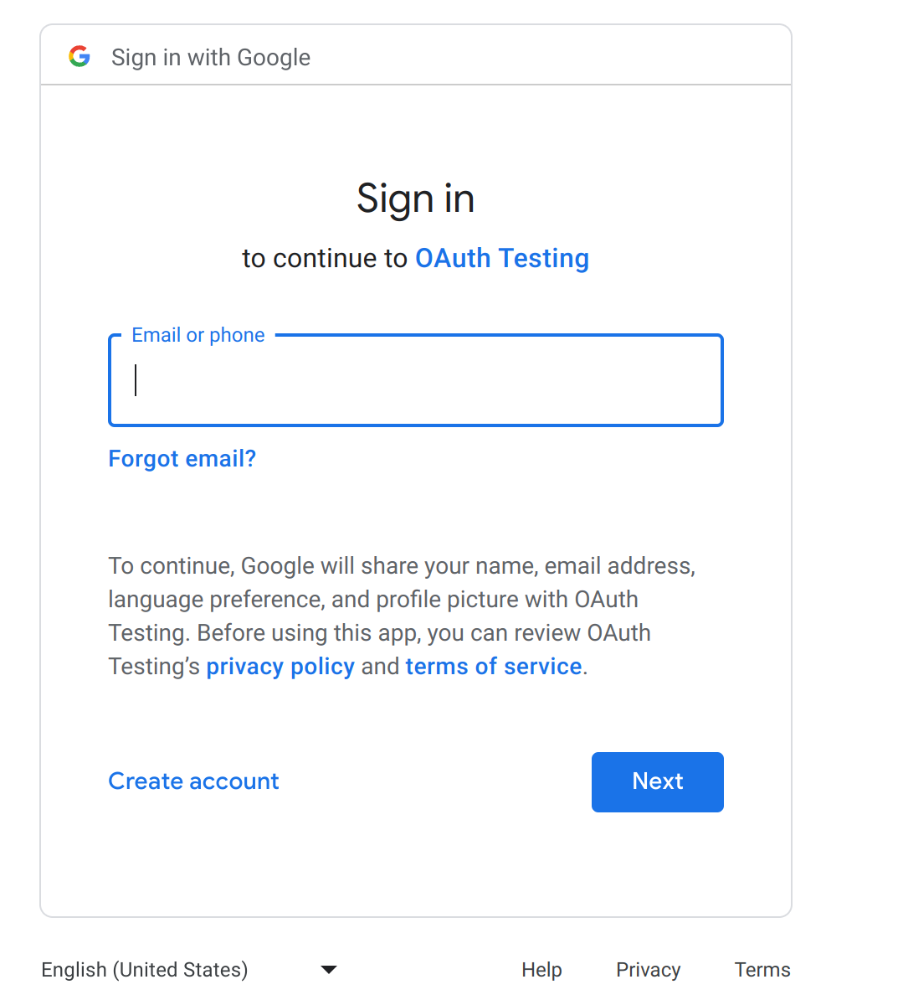

This repository implements a basic Rust server that uses OAuth2 to obtain the gmail from a Google user.
The implementation avoids the use of frameworks (regarding OAuth2 functionality) to exemplify the minimum basic OAuth2 workflow.

For brevity neither tests nor error handling has been implemented in this project.

Keep in mind that this project is only meant for explanation purposes. We do not take any responsability for the security or usability of the code. Please do your own research before taking anything into production.
# Interesting references
[OAuth 2.0 workflow by IBM](https://www.ibm.com/docs/en/tfim/6.2.2.6?topic=overview-oauth-20-workflow)

[Google's documentation](https://developers.google.com/identity/protocols/oauth2/web-server)


# Enabling OAuth2 for your Google account
To set up OAuth2 in your Google account you can follow the instructions described in [this document](oauth2_google_account.md).

# OAuth2 Workflow 
To access a Google user's information, we first need to get an access token through the OAuth2 protocol.

To explain the process we are going to define three entities:
- The **user** (client to our server that *wants to log in with* (or share information from) Google into our web application)
- The **server** (this server to which the user connects to, also the OAuth2 client)
- **Google's server** (the OAuth2 provider)

On the other hand, we are going to use the following variables (*that should be defined in the* [.env file](./.env) to run the project) throughout the process:
- **google_client_id**: this identifies the Google account that we have set up to use as the OAuth2 Client.
- **google_client_secret**: same as before, should only be shared directly with Google.
- **google_scope**: the user's information that we want to access. This should be within the scopes defined in the Google OAuth2 account configuration.
- **google_redirect_uri**: the uri to which Google will redirect the user, passing some parameters through the uri.

### 1. Get the authorization code
We need an authorization code to generate access tokens. This code will include scope information, hence the access token will only grant access to information within that scope.

1. Redirect the client to https://accounts.google.com/o/oauth2/v2/auth with at least the required parameters set in the url [[Google's parameter documentation](https://developers.google.com/identity/protocols/oauth2/web-server#httprest_1)]:
   
    (a way of doing it is creating a link that the **user** can click on)
    - scope = **google_scope** (for example *https://www.googleapis.com/auth/userinfo.email*)
    - redirect_uri = **google_redirect_uri** (*http://localhost:8080/google/redirect* the place where we want to receive the authorization code)
    - response_type = code
    - client_id = **google_client_id** (our client id from our Google account)

The final petition could look something like (remember that is the **user** who makes the petition):
```
GET https://accounts.google.com/o/oauth2/v2/auth?scope=https%3A%2F%2Fwww.googleapis.com%2Fauth%2Fuserinfo.email&redirect_uri=http%3A%2F%2Flocalhost%3A8080%2Fgoogle%2Fredirect&response_type=code&client_id=some-client-id

```
where *some-client-id* is the client id of our **server**.

If all the parameters have been configured correctly, the **user** should be able to see this page:
    <p align="center">
    
    </p>
If the redirect_uri has not been set correctly, or Google's information has not yet been updated that page will show an **Error 400: redirect_uri_mismatch**.

Now when the **user** logs in with their Google credentials, Google will make the **user** send a GET petition to the redirect url specified. That petition should look something like:
```
GET http://localhost:8080/google/redirect?code=some-url-encoded-authorization-code&scope=email+https%3A%2F%2Fwww.googleapis.com%2Fauth%2Fuserinfo.email+openid&authuser=0&prompt=none

```
where *some-url-encoded-authorization-code* is a real url encoded code.


### 2. Get the access token with the authorization code
In our **server** we will receive the **user's** authorization code encoded as an url parameter. We can now extract that code and use it to make a POST petition directly to **Google's** endpoint https://www.googleapis.com/oauth2/token passing the following parameters encoded in the url [[Google's parameter documentation](https://developers.google.com/identity/protocols/oauth2/web-server#exchange-authorization-code)]:

- code = (the authorization code we have received in the last step)
- client_id = **google_client_id**
- client_secret = **google_client_secret**(our client secret from our Google account)
- grant_type = authorization_code
- redirect_uri = **google_redirect_uri**(this is done to check that the redirect_url stays the same)

The POST petition from our **server** to **Google** should look something like:
```
POST https://www.googleapis.com/oauth2/token?code=some-url-encoded-authorization-code&client_id=some-client-id&client_secret=some-client-secret&grant_type=authorization_code&redirect_uri=http%3A%2F%2Flocalhost%3A8080%2Fapi%2Fsessions%2Foauth%2Fgoogle
```
where *some-url-encoded-authorization-code* is a real url encoded code, and where *some-client-id*=**google_client_id** and *some-client-secret*=**google_client_secret**.

If the petition is well formed, you should obtain the following data:
```
{
    "access_token": "some-access-token",
    "expires_in": 3599,
    "scope": "https://www.googleapis.com/auth/userinfo.email openid",
    "token_type": "Bearer",
    "id_token": "some-id-token"
}
```
where *some-access-token* is the real access token and *some-id-token* is a real id token.

### 3. Use the access token to get the user's information
Finally, once we have the access token, we can request **user** information from **Google** with a GET petition to https://www.googleapis.com/oauth2/v1/userinfo?alt=json, specifying the following Request Headers:
```
Content-Type: application/json
Authorization: Bearer some-access-token
```
where *some-access-token* is the real access token.

If the petition is well formed, we should obtain the following data:
```
{
  "id": "your-gmail-id",
  "email": "your-gmail-name@gmail.com",
  "verified_email": true,
  "picture": "link-to-your-gmail-picture"
}
```
where *your-gmail-id* will be a real gmail id, *your-gmail-name* will be the actual name of the account that has logged in and where *link-to-your-gmail-picture* will be an actual link.


# Build
To run this project you need to have Cargo installed [[installation reference](https://www.rust-lang.org/learn/get-started)].

Remember to replace the environment variables in the [.env file](./.env) with your [Google configuration]("./oauth2_google_account.md").

To execute just run in the repository home directory:
``` 
cargo run 
```
