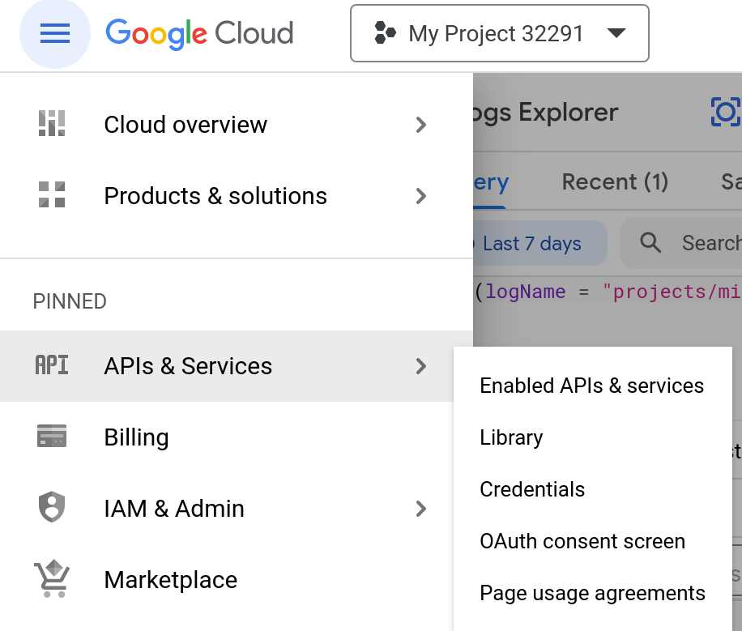

This document explains how to enable OAuth for your google account.

1. Go to https://console.developers.google.com/ and log in to your Google account.
2. At the top of the page there's a 'Select Project' button. When clicked a modal popup should appear.

    

    
    

3. Select in the top right the 'New Project' button. Enter the name for your project and complete the process
by clicking the 'Create' button.
    
    

    
    

4. When created you can access the project with the button used in **step 2**. Inside the project go to the 
OAuth consent screen using the left menu:

    

    
    

5. Select 'External' for the 'User Type' and use the 'Create' button. You will be redirected to the 
'Edit app registration' page where you can input all your credentials.
    

    
    

    In the 'App domain' section provide the domains for your home page, privacy policy and terms of service pages.

    *Remember that*: this urls should use **https** unless **localhost** is used, in that case **http is accepted**.

    To run this example project you could introduce http://localhost:8080 in all of those fields.
Fill the remaining required information and click on the 'SAVE AND CONTINUE' button.

6. Next in the scopes page, specify the scopes required to run your application. To run this project make 
sure to include *../auth/userinfo.email* from the list of options. When finished, once again, click on the 'SAVE AND CONTINUE' button.

7. You should now be redirected to the 'Test Users' screen. Add the email addresses of the accounts you want to use to test the application using the 'ADD USERS' button.
When finished click on the 'SAVE AND CONTINUE' button.

    A summary of your application should appear, review all the information and continue with the next step.

8. Now that your app is created, navigate to the 'Credentials' page and click the top button 'CREATE CREDENTIALS'. Within the dropdown menu, select the 'OAuth client ID' option.
    

    
    

9. Inside the 'Create OAuth client ID' page select 'Web application' as the application type.
Also make sure to specify the authorized redirect uri which, in our case, should be http://localhost:8080/google/redirect.

    *The redirect uri may take a few minutes to update.*

10. To finish, click the 'Create' button. You should be redirected to the 'Credentials' page, where you can find your client ID and client secret that should be copied to the **.env** file from this project.

